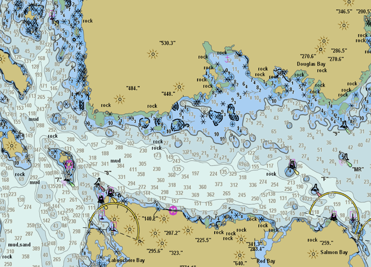

# maritime-charting-quick-tutorial

The purpose of this tutorial is to guide you through the basic process of importing, creating and exporting S-57 products in ArcGIS for Maritime: Charting. You will learn how to ingest an S-57 file into the Esri geodatabase, create an S-57 product in the Esri product management system, and export an S-57 back out of the geodatabase. 
More information on the ArcGIS for Maritime: Charting product

[here](http://www.esri.com/software/arcgis/extensions/maritime/charting).

## Features
* Exercise 1: Exporting an ENC product
* Exercise 2: Creating a new ENC product and exporting a New Edition
* Exercise 3: Importing an S-57 file, creating a new product, and exporting a New Dataset

## Instructions

1.	Install ArcGIS for Desktop on your computer
2.	Install the ArcGIS for Maritime: Charting extension
(see [http://www.esri.com/software/arcgis/extensions/maritime/charting/pricing]( http://www.esri.com/software/arcgis/extensions/maritime/charting/pricing) for information on how to contact Esri or your local distributor)
3.	Clone or Download the .zip file (buttons on the right of this page)
4.	Follow the instructions and exercises in the document ‘Tutorial/ArcGIS for Maritime Charting Quick Tutorial.docx’

## Requirements

* ArcGIS for Desktop Advanced
* ArcGIS for Maritime: Charting

## Resources

* [ArcGIS for Maritime: Charting product page]( http://www.esri.com/software/arcgis/extensions/maritime/charting)
* [ArcGIS Blog](http://blogs.esri.com/esri/arcgis/)
* [twitter@esri](http://twitter.com/esri)

## Issues

Find an issue with the tutorials?  Please let us know by submitting an issue.

## Contributing

Esri welcomes contributions from anyone and everyone. Please see our [guidelines for contributing](https://github.com/esri/contributing).

## Licensing
Copyright 2015 Esri

Licensed under the Apache License, Version 2.0 (the "License");
you may not use this file except in compliance with the License.
You may obtain a copy of the License at

   http://www.apache.org/licenses/LICENSE-2.0

Unless required by applicable law or agreed to in writing, software
distributed under the License is distributed on an "AS IS" BASIS,
WITHOUT WARRANTIES OR CONDITIONS OF ANY KIND, either express or implied.
See the License for the specific language governing permissions and
limitations under the License.

A copy of the license is available in the repository's [license.txt](license.txt?raw=true) file.
